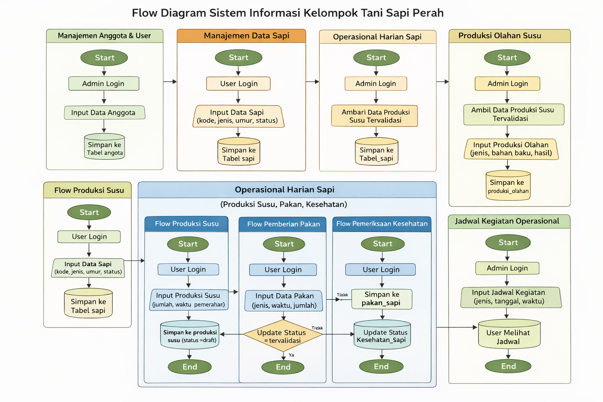
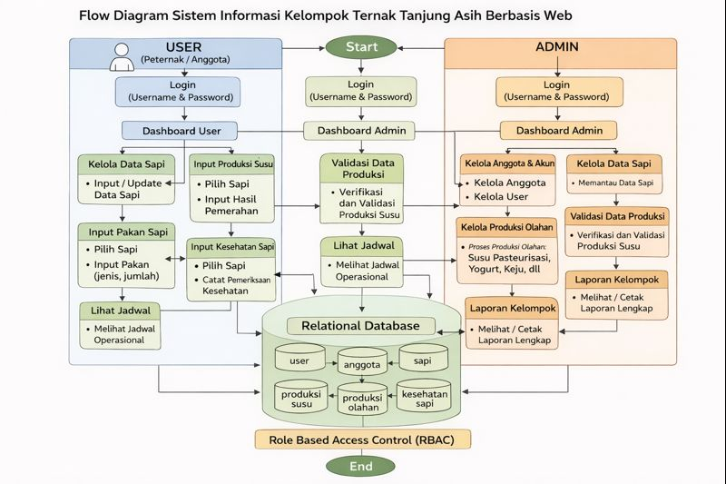

# Sistem Informasi Kelompok Tani Ternak Tanjung Asih Berbasis Web

Sistem Informasi terintegrasi untuk pengelolaan peternakan sapi perah, mulai dari pencatatan populasi, produksi susu, pakan, kesehatan, hingga laporan hasil olahan. Sistem ini menerapkan **Role Based Access Control (RBAC)** untuk menjamin keamanan dan akurasi data.

## 🚀 Teknologi yang Digunakan

- **Core**: PHP
- **Database**: MySQL
- **Styling**: TailwindCSS
- **Icons**: FontAwesome
- **Format Laporan**: Export PDF/Excel

---

## 📊 Diagram Sistem

### Entity Relationship Diagram (ERD)

Relasi antar tabel untuk menjamin integritas data (Master Anggota, User, Sapi, hingga Log Aktivitas).


### Flowchart Sistem

Alur kerja pengguna mulai dari Login hingga manajemen data sesuai hak akses (Admin & User).


---

## 👥 Pengguna & Hak Akses

### 1. Admin

Memiliki kontrol penuh terhadap sistem:

- **Manajemen Master**: Anggota, User, Sapi, dan Populasi.
- **Validasi**: Memvalidasi data input dari user (peternak).
- **Operasional**: Mengelola pakan, kesehatan, produksi olahan, dan jadwal kegiatan.
- **Laporan**: Melihat dan mencetak seluruh laporan kelompok.

### 2. User (Peternak)

Memiliki akses terbatas pada data miliknya sendiri:

- **Input Data**: Produksi susu (khusus induk laktasi), pakan, dan kesehatan sapi.
- **Monitoring**: Melihat data sapi pribadi dan jadwal kegiatan kelompok.
- **Laporan**: Melihat laporan kinerja pribadi.

---

## 📜 Aturan Bisnis & Validasi Otomatis

Untuk menjaga konsistensi data, sistem ini dilengkapi dengan validasi otomatis:

1.  **Sapi Laktasi**: Input produksi susu hanya diizinkan untuk sapi kategori `Induk` dengan status `Laktasi`.
2.  **Keamanan Data**: User (Peternak) hanya dapat melihat dan mengelola data yang terkait dengan `id_user` miliknya.
3.  **Status Sapi**: Sapi yang berstatus `Mati` atau `Dijual` otomatis terkunci dari semua input transaksi.
4.  **Audit Trail**: Seluruh aktivitas (Login, Insert, Update, Delete) dicatat dalam tabel `log_aktivitas`.

---

## 📂 Struktur Database Utama

Beberapa tabel inti dalam sistem ini meliputi:

- `anggota` & `user`: Manajemen identitas dan akun.
- `sapi`: Data induk ternak, umur, kategori, dan status kesehatan.
- `produksi_susu`: Pencatatan volume susu (Pagi/Sore).
- `pakan_sapi`: Monitoring jenis dan waktu pemberian pakan.
- `kesehatan_sapi`: Riwayat medis dan tindakan dokter hewan/mantri.
- `produksi_olahan`: Pengelolaan susu menjadi Pasteurisasi, Yogurt, Keju, atau Mentega.

---

## 🔧 Instalasi

1.  **Clone Repository**:
    ```bash
    git clone [https://github.com/username/ternak-tanjung-asih.git](https://github.com/username/ternak-tanjung-asih.git)
    ```
2.  **Database**:
    - Buat database bernama `db_kelompok_tani`.
    - Import file `db_kelompok_tani.sql` ke phpMyAdmin.
3.  **Konfigurasi**:
    - Sesuaikan kredensial database pada folder `includes/`.
4.  **Jalankan**:
    - Akses sistem melalui `http://localhost/ternak-tanjung-asih`.

---

© 2025 Fachri Ramdhan.
